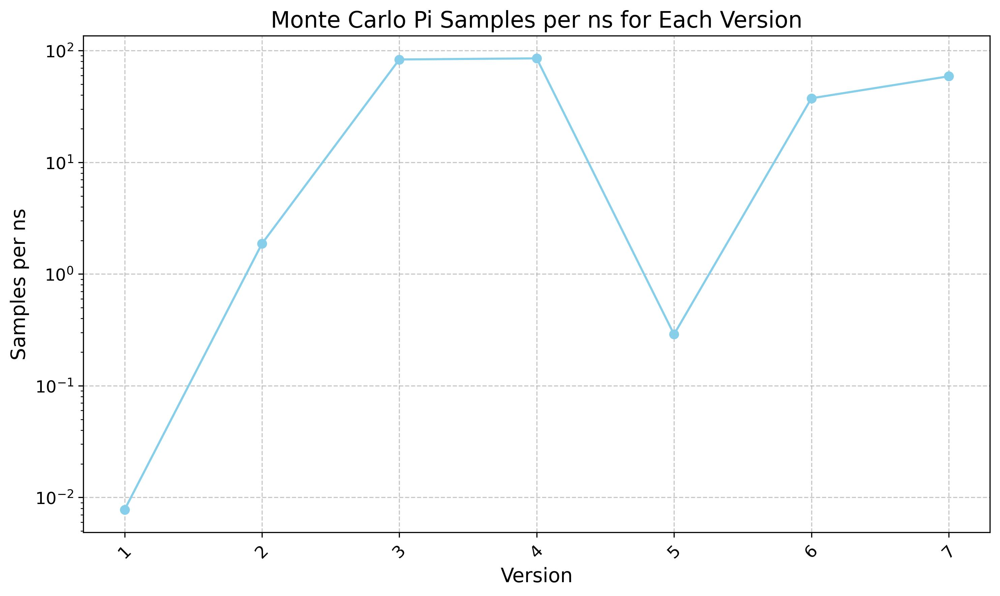

# Monte Carlo Pi with CUDA
 
This repository contains different implementations of a Monte Carlo method for approximating the value of pi using CUDA. The project explores various optimization techniques and strategies to improve performance inspired by [Blog Post Link](https://siboehm.com/articles/22/CUDA-MMM).

## Versions

1. **Version 1 (Naive)**: A basic (very naive) serial implementation of the Monte Carlo Pi approximation algorithm.

2. **Version 2 (Parallel Blocks)**: This version introduces parallelism by launching multiple CUDA blocks to perform the Monte Carlo simulations.

3. **Version 3 (Parallel Blocks and Threads)**: Building upon Version 2, this implementation also utilizes CUDA threads within each block for additional parallelism.

4. **Version 4 (Warp Reduction)**: This version employs warp reduction to efficiently combine the results from individual threads within a warp, reducing the number of global memory accesses.

5. **Version 5 (Atomics)**: This implementation uses atomic operations to update a shared counter in global memory. However, due to the high contention for the shared counter, this approach is generally not recommended for performance.

6. **Version 6 (Warp Reduction with Philox RNG)**: Similar to Version 4, but it uses the Philox random number generator (RNG) instead of the default CUDA RNG.

7. **Version 7 (Float4 Philox RNG)**: This version further optimizes Version 6 by using the `float4` data type with the Philox RNG, generating four random numbers per thread simultaneously.

## Performance Comparison

The following chart shows the performance of each version in terms of Monte Carlo Pi samples computed per millisecond run on NVIDIA GeForce GTX 1650:

## Getting Started

To run the code and compare the performance of different versions, follow these steps:

1. Clone the repository
2. Navigate to the project directory
3. Compile and run each version individually. For example, to run Version 7:
nvcc version_7/pi_v7.cu -o pi_v7
./pi_v7
Copy code
This will compile the CUDA code and run the executable, printing the performance results to the console.

4. Repeat step 3 for each version you want to test and compare the performance.

## Contributing

Contributions to this project are welcome! If you find any bugs or have suggestions for further optimizations, please open an issue or submit a pull request.

## License

This project is licensed under the [MIT License](LICENSE).